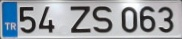

# Number Plate Area Crop

## About
This simple project written with Python and Library of OpenCV. Project, reads to car image. Then crops the number plate area using Perspective Transform. Than area is saved.

### The following is example of process
##### >> A Car >>

##### >> Cropped Number Plate >>

